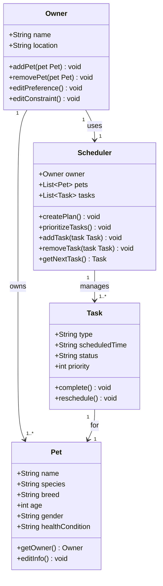

# PawPal+ UML Class Diagram

```mermaid
classDiagram
    class Owner {
        +String name
        +String location
        +addPet(pet Pet) void
        +removePet(pet Pet) void
        +editPreference() void
        +editConstraint() void
    }

    class Pet {
        +String name
        +String species
        +String breed
        +int age
        +String gender
        +String healthCondition
        +getOwner() Owner
        +editInfo() void
    }

    class Task {
        +String type
        +String scheduledTime
        +String status
        +int priority
        +complete() void
        +reschedule() void
    }

    class Scheduler {
        +Owner owner
        +List~Pet~ pets
        +List~Task~ tasks
        +createPlan() void
        +prioritizeTasks() void
        +addTask(task Task) void
        +removeTask(task Task) void
        +getNextTask() Task
    }

    Owner "1" --> "1..*" Pet : owns
    Owner "1" --> "1" Scheduler : uses
    Scheduler "1" --> "1..*" Task : manages
    Task "1" --> "1" Pet : for
```
